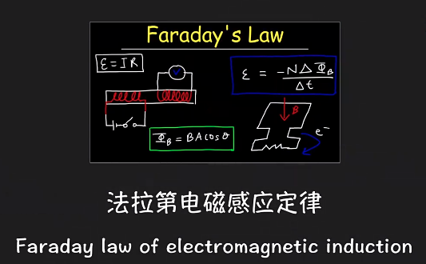
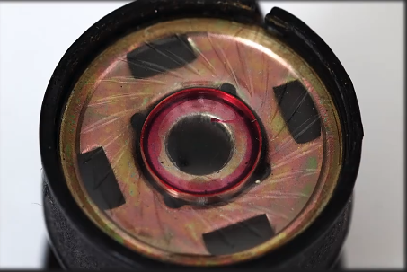
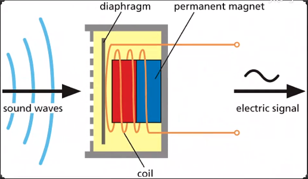
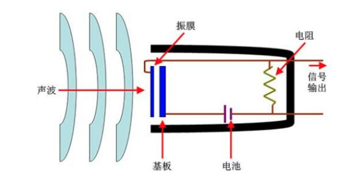
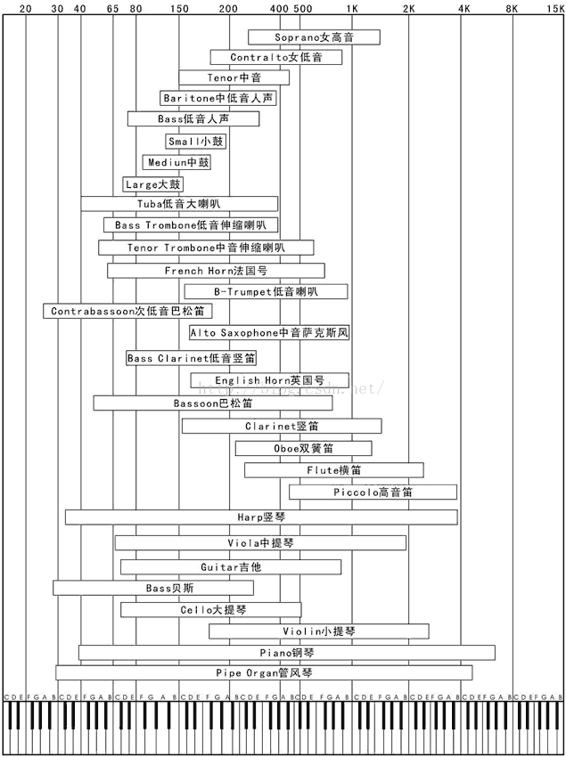

## 声音与哲学
在探索声音前，我们先来看个有趣的问题：

有人在知乎上问：
>如果世界上没有声音那世界会怎么样?

结果最高票的回答是：
>世界上是没有声音的！！声音不是客观存在！！

[如果世界上没有声音那世界会怎么样？ - 李如春的回答 - 知乎](https://www.zhihu.com/question/52928318/answer/132691966)

看完文章是不是是不是非常惊喜，原来声音的问题都可以上升到哲学层面了。

简单来说，声音的产生有三个要素, 离开任何一环，都没有声音产生。
1. __物体振动产生的波；__
2. __传播媒介（如空气）；__
3. __人耳的接收与大脑解读。__

因此，声音是人耳对一定频率振动波(振动频率16HZ~20000HZ的波)的反应和解读，而非客观实在。  
也就是说自然界中只存在振动波和传播媒介，而没有"响"声。

## 最早的录音
最早录音也许要追溯到130年前，具体是谁，直到今天都一直有争议，很多人说是爱迪生，很多人说是贝尔，也有很多人说是法国的scott，这里我们就认为是一个外国人好了。

早期的录音机器大概是这个样子的，需要一个大喇叭收集声音，然后手摇传动轴，声音被记录在一张煤灰纸上。那时候的录音只能刻画声音的样子，却没办法播放，直到近些年才有团队利用高科技还原了当年的声音，有兴趣的可以在firstsound的网站查阅。
[firstsound-传送](http://firstsounds.org/)

## 来自一百多年前的录音

1. Mary-had-a-little-lamb  
   不仔细听，都不知道这是一首歌，可以对着歌词细细品味。
    >“玛丽有一只小羊羔，它的羊毛像雪一样白，玛丽去的每个地方。”最后，他用一句：“哦，不！”结束了录音。
     

[Mary-had-a-little-lamb](Res/mda-imcre1riuq0de4dp.mp3 ':include :type=audio')
 

2. By the Light of the Moon  
   我们还是对着乐谱来听才有感觉。😁

    

    <figure>
        <figcaption>Au Clair de la Lune - By the Light of the Moon (April 9, 1860)</figcaption>
        <audio
            controls
            src="ScienceArticles/Res/Scott-Feaster-No-36.mp3">
                By the Light of the Moon
        </audio>
    </figure>
    
3. Vocal Scale  
   >“哆瑞咪发嗦啦西多”

    <figure>
        <figcaption>Gamme de la Voix - Vocal Scale (May 17, 1860) </figcaption>
        <audio
            controls
            src="ScienceArticles/Res/1860-Vocal-Scale.mp3">
                By the Light of the Moon
        </audio>
    </figure>

## 留声机录音和黑胶唱片播放原理
早期的录音机是怎么录音的呢？
简单来说，通过接受外界的声音震动，转化为探针的震动，将震动记录在黑胶上。

播放的原理是唱针接触到黑胶纹路，产生摩擦，还原了当时刻录的震动声波，再通过电音把震动声放大数千倍，就形成了黑胶音乐，原始胶片还原度最高了。

## 数字化记录
随着时代的发展，通过黑胶刻录的时代逐步过去，接着是磁带技术的新老交替， 而如今，数字电子技术的发展和集成电路技术的进步，录音机的性能和功能都达到了前所未有的水平。
这里我们简单来介绍一下

1. 麦克风工作原理。以常见麦克风分为动圈和电容为例：  
__动圈麦克风(Dynamic Micphone):__  
原理要从法拉第电磁感应定律说起：  
  
简单说就是封闭线圈在磁场中做切割运动，就会产生感应电压。  
下面就是麦克风解刨放大图，可以看到一层薄膜和金属线圈，薄膜用来接受外界空气震动，推动线圈在磁场中做切割运动，从而将声音的震动转换成电信号。
  
   
[参考:TT Production 动圈话筒的工作原理 - 汤伟彬的文章 - 知乎](
https://zhuanlan.zhihu.com/p/112464508)  
__电容麦克风(Condenser Micphone):__   
电容式麦克风有两块金属极板，其中一块表面涂有驻极体薄膜并将其接地，另一极板接在场效应晶体管的栅极上，栅极与源极之间接有一个二极管，当驻极体膜片本身带有电荷，表面电荷地电量为Q，板极间地电容量为C，则在极头上产生地电压U=Q/C，当受到振动或受到气流地摩擦时，由于振动使两极板间的距离改变，即电容C改变，而电量Q不变，就会引起电压的变化，电压变化的大小，反映了外界声压的强弱。当前嵌入式设备中，大部分采用体积小，灵敏度高的电容麦克风。常用的两种电容式麦克风：驻极体电容麦克风（ECM）和微机电麦克风（MEMS Micphone 也称硅麦）。  

2. 数字化记录和播放过程: 通过接受外界声音的震动，从而改变测量点的电压值，将采集的值进行一定格式的编码([PCM](https://baike.baidu.com/item/PCM/1568054?fr=aladdin))记录在计算机中存储为原始音频文件。播放则按照存储的格式从新将数据取出，转换成数字信号传递给喇叭进行播放。

3. 采样参数说明: 
   - 采样率：一秒需要采集多少个点数据；
   - 采样精度：每个数据需要多少位来存储；
   - 采样通道：需要采样多少个通道，比如人就是双通道录音（左耳和右耳），单通道播放（一个嘴巴）；
   - 录音为什么是16k/16bit?  
        __16k采样频率:__ 实际的情况下，采集频率往往比信号的实际频率要高出5到10倍以上。因为采集频率仅仅高于信号频率的2倍([乃奎斯特定律](https://www.zhihu.com/question/24490634/answer/490847222))的情况下，是很难获取测量的精度的。而人的发音频率集中在80HZ~1200HZ,所以16KHZ采样频率能够尽量减少失真的情况采集到人的声音信号。  
        __16bit采样位数:__ 2^16=65536,20log(65536)约等于96dB的动态范围,足够覆盖一般场景,比如覆盖安静的夜晚(30dB)到球磨机工作(约120dB)。
   - 播放的音频为什么是44.1k  
        __44.1k播放音频:__ 因为人耳的听觉范围大概在20Hz～20kHz，如果想还原20khz的音频采样频率至少要40khz ,但是梳状滤波器不可能是完美的，截止频率不能完全截断，所以需要将通带适当放开，增加一个大概10%衰减缓冲的带宽，所以就需要44k的播放音频，具体为什么是44.1k，这个就和播放的格式和数据的编码传输有关。
  
说钢琴是乐器国王不是没有道理的。

## 海上钢琴师
最后来享受一首《Playing Love》

<video controls width="640">
    <source src="ScienceArticles/Res/playinglove.mp4"
            type="video/webm">
    Sorry, your browser doesn't support embedded videos.
</video>